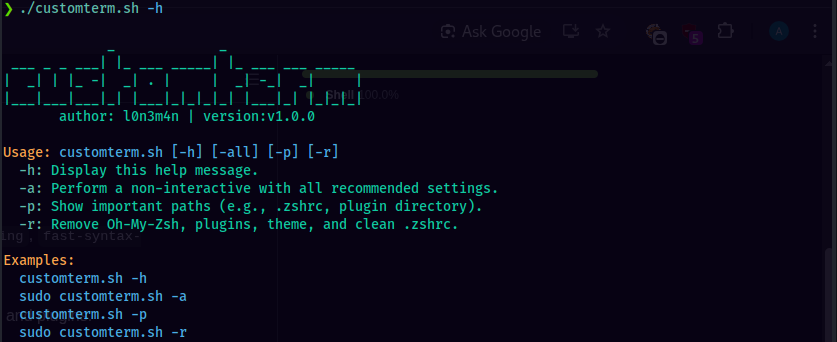

<h1 align="center">
Customterm 
</h1>

<p align="center">
    <a href="https://visitorbadge.io/status?path=https%3A%2F%2Fgithub.com%2Fl0n3m4n%2Fcustom-terminal">
    
    </a>
    <a href="https://www.facebook.com/l0n3m4n">
        
    </a>
      <a href="https://www.twitter.com/l0n3m4n">
        
    </a>
    <a href="https://medium.com/@l0n3m4n">
        
    </a>
    <a href="https://www.kali.org/">
          
    </a>
</p>

Customterm automates the setup of a custom Zsh terminal environment for both Linux and macOS...

## Features

*   Automated installation of Zsh, curl, and git (if not already present).
*   Checks for amd64 architecture.
*   Automated installation of Oh-My-Zsh.
*   Installs Powerlevel10k theme.
*   Installs selected Zsh plugins: `zsh-autosuggestions`, `zsh-syntax-highlighting`, `fast-syntax-highlighting`, and `zsh-autocomplete`.
*   Manages `.zshrc` configuration, including backup options.
*   Idempotent installations: gracefully handles existing installations of Oh-My-Zsh and plugins.
*   Sudo access check for dependency installation.

## Getting Started

### Prerequisites

*   A Linux distribution (tested on Debian/Ubuntu, Fedora, Arch-based systems) or macOS.
*   `sudo` privileges for installing system dependencies (Linux only).
*   Homebrew (for macOS users): The script will prompt to install it if not found.

### Installation

1.  **Clone the repository (or download the script):**
    ```bash
    git clone https://github.com/l0n3m4n/customterm.git
    cd customterm
    ```
    or simply download the `customterm.sh` script:
    ```bash
    curl -o customterm.sh https://raw.githubusercontent.com/l0n3m4n/customterm/refs/heads/main/customterm.sh
    chmod +x customterm.sh
    ```

### **Run the script:**

 
### Post-Installation

After the script completes, it will prompt you to restart your shell. You can do this by typing `exec zsh` or by closing and reopening your terminal.

You may then need to configure Powerlevel10k by running `p10k configure` in your new Zsh terminal.


## License

This project is licensed under the MIT License - see the `LICENSE` file for details.
